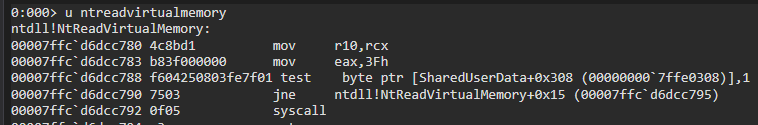
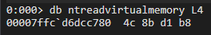
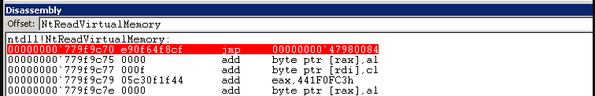
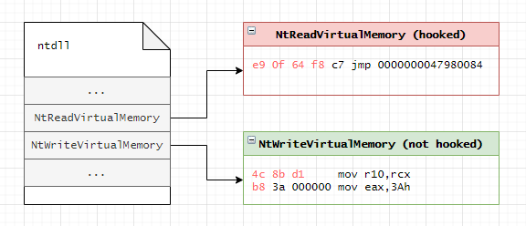
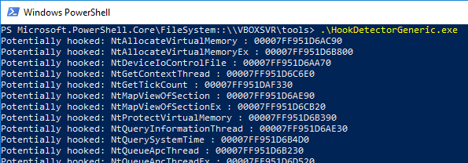

# Detect Hooked Syscalls

Enumerate which window API calls are hooked by an EDR using inline patching technique

# Walk through

## Function before Hooking

Below shows the stub for for NtReadVirtualMemory on a system with no EDR present, meaning the syscall NtReadVirtualMemory is not hooked:
<p align="center"></p>

We can see the NtReadVirtualMemory syscall stub starts with instructions:

```
    00007ffc`d6dcc780 4c8bd1          mov     r10,rcx
    00007ffc`d6dcc783 b83f000000      mov     eax,3Fh
    ...
```

    The above applies to most routines starting with Zw, i.e ZwReadVirtualMemory too.

...which translates to the following 4 opcodes:

```
    4c 8b d1 b8
```

<p align="center"></p>

## Function after Hooking

Below shows an example of how NtReadVirtualMemory syscall stub looks like when it's hooked by an EDR:
<p align="center"></p>

Note that in this case, the first instruction is a jmp instruction, redirecting the code execution somewhere else (another module in the process's memory):

```
    jmp 0000000047980084
```

...which translates to the following 5 opcodes:

```
    e9 0f 64 f8 c7
```

    e9 - opcode for near jump 0f64f8c7- offset, which is relative to the address of the current instruction, where the code will jump to.

## Checking for Hooks

Knowing that interesting functions/syscalls (that are often used in malware), starting with Nt | Zw, before hooking, start with opcodes: 4c 8b d1 b8, we can determine if a given function is hooked or not by following this process:

1. Iterate through all the exported functions of the ntdll.dll

2. Read the first 4 bytes of the the syscall stub and check if they start with 4c 8b d1 b8

    1. If yes, the function is not hooked

    2. If no, the function is most likely hooked (with a couple of exceptions mentioned in the False Positives callout).

Below is a simplified visual example attempting to further explain the above process:

1. NtReadVirtualMemory starts with opcodes e9 0f 64 f8 rather than 4c 8b d1 b8, meaning it's most likely hooked

2. NtWriteVirtualMemory starts with opcodes 4c 8b d1 b8, meaning it has not been hooked

<p align="center"></p>

## Detecting who placed the Hook

As additional verification for a function really being hooked by a different DLL, we can resolve the jump target and check which module it belongs to using GetMappedFileName.

This can also help detect false-positives. If the jump leads into ntdll.dll itself, it is either supposed to be there, or it could be a more sophisticated hook trying to disguise itself against this technique.

```cpp
    if (*((unsigned char*)targetFunction) == 0xE9) // first byte is a jmp instruction, where does it jump to?
    {
        // E9 jump instruction has 32bit offset, relative to the address of the first instruction AFTER our jump instruction.
        DWORD jumpTargetRelative = *((PDWORD)((char*)functionAddress + 1));
        // Its possible for target to be 0x000025FF, which is jmp QWORD PTR [rip+0x0], or similar variants, this is not handled in this example
        PDWORD jumpTarget = targetFunction + 5 /*Instruction pointer after our jmp instruction*/ + jumpTargetRelative;  
        char moduleNameBuffer[512];
        GetMappedFileNameA(GetCurrentProcess(), jumpTarget, moduleNameBuffer, 512);
    }
```

    False Positives

    ****Although highly effective at detecting functions hooked with inline patching, this method returns a few false positives when enumerating hooked functions inside ntdll.dll, such as:

    NtGetTickCount
    NtQuerySystemTime
    NtdllDefWindowProc_A
    NtdllDefWindowProc_W
    NtdllDialogWndProc_A
    NtdllDialogWndProc_W
    ZwQuerySystemTime
    The above functions are not hooked.

## Demo

Below is a snippet of the output of the program compiled from the above source code and run on a system with an EDR present. It shows some of the interesting functions (not all displayed) that are most likely hooked, with an exception of NtGetTickCount, which is a false positive, as mentioned earlier:

<p align="center"></p>
